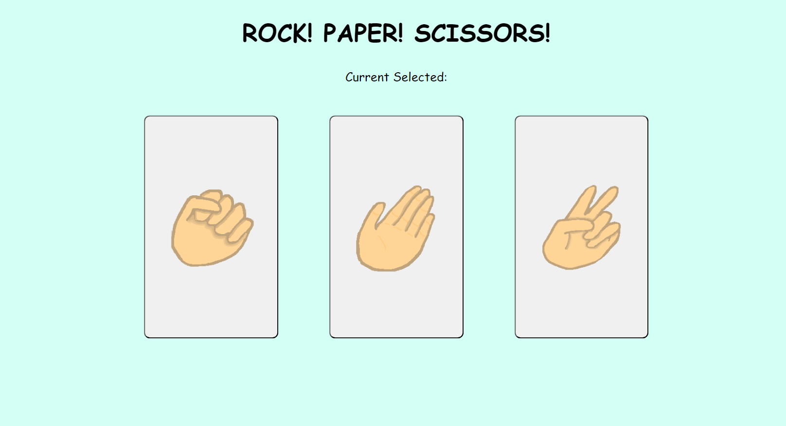
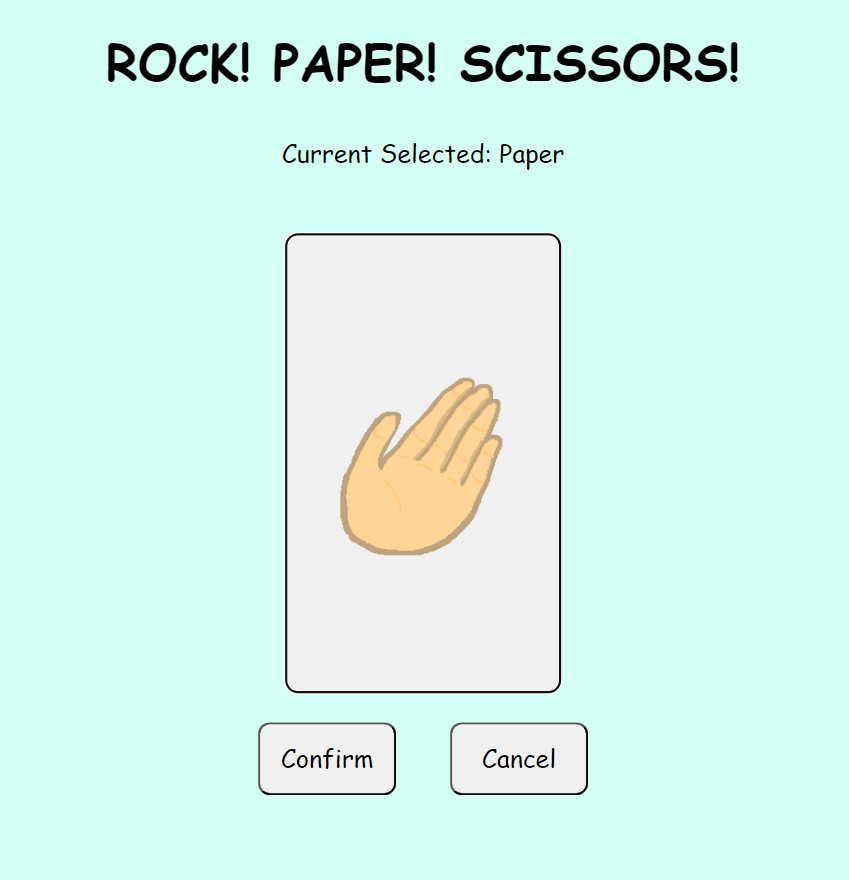
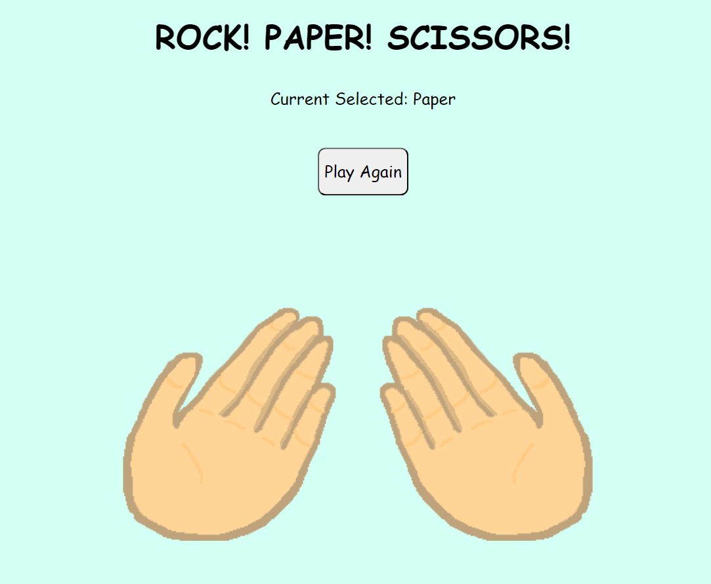

<h1>RPS in JSX and React</h1>

<h2>Learned</h2>
<ul>
  <li>Using basic React and JSX</li>
  <li>Using useState and useEffect</li>
  <li>CSS Transitions</li>
  <li>Short Circiuting</li>
  <li>Window Scaling (not fully implemented)</li>
</ul>
<h2>Improving for Later Projects</h2>
  <li>Better understand of JS</li>
  <li>Better understand of what JSX can do</li>
  <li>Understand to add multiple JSX files for compents</li>
<h2>Known Issues</h2>
Window Scaling 
<li>I understand how to changed the scale based on window size, but I would rather put more  effort into a project that is more benefitial</li>
<li> If  you can the window scale while not on the opening screen, it will look weird since I updated some elements when ever the scale changes, however you arent supposed to change the scale while the game is running</li>
